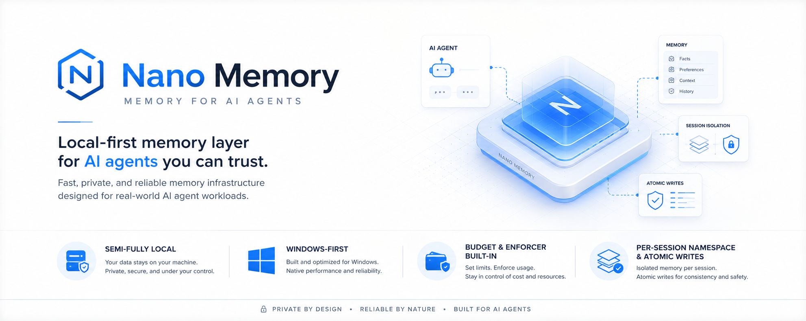

<div align="center">



<br/>

**Persistent memory layer for AI agents — hybrid local/cloud embeddings, built to fix what mem0 got wrong.**

[](https://python.org)
[](LICENSE)
[]()
[]()
[]()

</div>

---

## The Problem

AI agents forget everything between sessions. Every new conversation, you re-explain your stack, your preferences, your project context. Existing solutions (mem0, MemGPT) require cloud accounts, break on Windows, corrupt state on crash, and leak memory across agents.

**nano-memory fixes all of it.**

---

## What Makes It Different

| Problem with others | nano-memory solution |
|---|---|
| Requires cloud account / their API | **Fully local** — SQLite + numpy, zero external services required |
| Windows support broken | **Windows-first** — tested on PowerShell, no POSIX assumptions |
| Memory leaks across agents/sessions | **Namespace isolation** — every agent/session gets its own scope |
| No cost visibility on embedding calls | **Cost tracking** — per-session USD counters, budget alert + hard kill |
| Corrupt state on crash | **Atomic writes** — temp file + `os.replace` + fsync, zero corruption |
| Hardcoded cloud embedder | **Hybrid embeddings** — local (sentence-transformers) or OpenAI, config-driven |
| No CLI | **Full CLI** — `nano-mem save/search/list/forget/export/cost` |

---

## Quick Start

```bash
# Install (local embeddings)
pip install git+https://github.com/ghanibot/nano-memory-agent.git

# Install with OpenAI embeddings
pip install "git+https://github.com/ghanibot/nano-memory-agent.git#egg=nano-memory[openai]"

# Save a memory
nano-mem save "user prefers TypeScript over JavaScript" --type preference

# Search memories
nano-mem search "what language does user prefer?"

# List all memories
nano-mem list

# Cost report
nano-mem cost
```

---

## Python API

```python
from nano_memory import Memory

mem = Memory()  # uses local embeddings, default namespace

# Save facts, preferences, episodes, or large context blobs
mem.save("user prefers TypeScript", type="preference")
mem.save("project uses PostgreSQL on port 5432", type="fact")
mem.save("fixed auth bug by adding token expiry check", type="episode")

# Semantic search — returns top-k by cosine similarity
results = mem.search("what database are we using?")
for r in results:
    print(f"[{r.score:.2f}] {r.text}")

# recall() formats results as a string ready to inject into LLM context
context = mem.recall("user preferences")
print(context)

# Namespace isolation — different agents, different memory
agent_a = Memory(namespace="agent-researcher")
agent_b = Memory(namespace="agent-writer")

# Cost report
print(mem.cost_report())
```

---

## Configuration

```yaml
# memory.yaml
namespace: "my-project"

embedder:
  provider: local                  # or: openai
  model: "all-MiniLM-L6-v2"       # local model; "text-embedding-3-small" for openai
  api_key_env: "OPENAI_API_KEY"    # env var name for cloud providers

store:
  path: "~/.nano-memory"           # SQLite lives here

budget:
  max_cost_usd: 5.0
  alert_at_percent: 0.8
  kill_on_exceed: false            # set true for hard enforcement

top_k: 5           # default search results
chunk_size: 512    # chars — context type auto-chunked
chunk_overlap: 64
```

```python
from nano_memory import Memory, load_config

cfg = load_config("memory.yaml")
mem = Memory(cfg)
```

---

## Memory Types

| Type | Use case |
|---|---|
| `fact` | Declarative statements ("project uses PostgreSQL") |
| `preference` | User/agent preferences with implicit strength |
| `episode` | Timestamped events ("fixed auth bug on 2026-05-10") |
| `context` | Large text (docs, code) — auto-chunked + embedded |

---

## Architecture

```
MemoryConfig (YAML or Python)
         │
         ▼
      Memory
      ├── EmbedderFactory   — config-driven: local | openai
      │   ├── SentenceTransformerEmbedder  (free, offline)
      │   └── OpenAIEmbedder               (text-embedding-3-small/large)
      ├── SQLiteStore       — thread-safe, cosine search via numpy, atomic writes
      │   └── atomic_writer — temp + os.replace + fsync
      └── EmbedCostTracker  — per-session + global USD counters, budget enforcer
```

---

## Embedding Providers

| Provider | Model | Cost | Requires |
|---|---|---|---|
| `local` | `all-MiniLM-L6-v2` | Free | `sentence-transformers` |
| `openai` | `text-embedding-3-small` | $0.02 / 1M tokens | `openai` + API key |
| `openai` | `text-embedding-3-large` | $0.13 / 1M tokens | `openai` + API key |

---

## CLI Reference

```bash
nano-mem save   <text> [--type fact|episode|preference|context] [--namespace X]
nano-mem search <query> [--top-k 5] [--namespace X]
nano-mem list   [--namespace X] [--type X]
nano-mem forget <id>
nano-mem clear  [--namespace X]
nano-mem cost
nano-mem export <output.json>
```

---

## Integration with nano-orchestrator

nano-memory pairs with [nano-orchestrator](https://github.com/ghanibot/nano-orchestrator). Each agent gets its own namespace; memories persist between runs.

```python
from nano_memory import Memory

# In researcher agent:
mem = Memory(namespace="researcher-agent")
mem.save("found 3 relevant papers on transformer attention")

# In writer agent:
mem = Memory(namespace="researcher-agent")
context = mem.recall("what did researcher find?")
# inject context into writer's prompt
```

---

## Contributing

```bash
git clone https://github.com/ghanibot/nano-memory-agent
cd nano-memory-agent
pip install -e ".[dev]"
pytest
```

---

## License

MIT — see [LICENSE](LICENSE)
